  

 

▶ <a href="https://arkanji.com/images/posts/iwork-studio-film-v3.mp4"><b>Watch the film with sound</b></a> &nbsp;·&nbsp; <a href="https://arkanji.com/posts/iwork-studio-launch/">Read the launch story</a> &nbsp;·&nbsp; <a href="https://github.com/Arkanji/iwork-studio">Star the repo</a>

  

  

  

 

